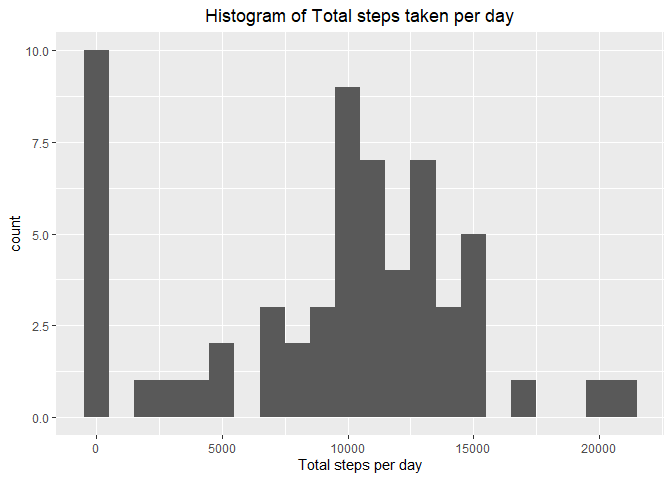

## Loading and preprocessing the data
Loading the data and transform the date variable format; load package

```r
acti <- read.csv( unz("activity.zip", filename = "activity.csv") , header = TRUE, sep = ",")
acti$date <- as.Date(acti$date)

library(ggplot2)
```

```
## Warning: package 'ggplot2' was built under R version 4.0.2
```
## What is mean total number of steps taken per day?
Calculate the total steps take per day and plot

```r
stepDay <- tapply(acti$steps, acti$date, sum, na.rm = TRUE)
stepDayDF <- data.frame(stepTtlDay = stepDay, Day = unique(acti$date))
g <- ggplot(stepDayDF, aes(stepTtlDay))
g + geom_histogram(binwidth = 1000) + labs(x = "Total steps per day", 
                                           title = "Histogram of Total steps taken per day")
```

<!-- -->

## What is the average daily activity pattern?


## Imputing missing values


## Are there differences in activity patterns between weekdays and weekends?
