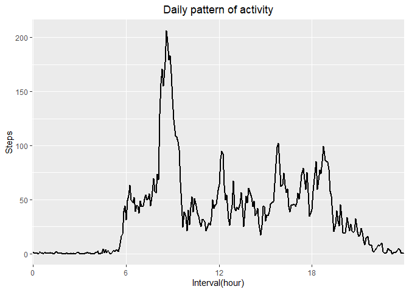
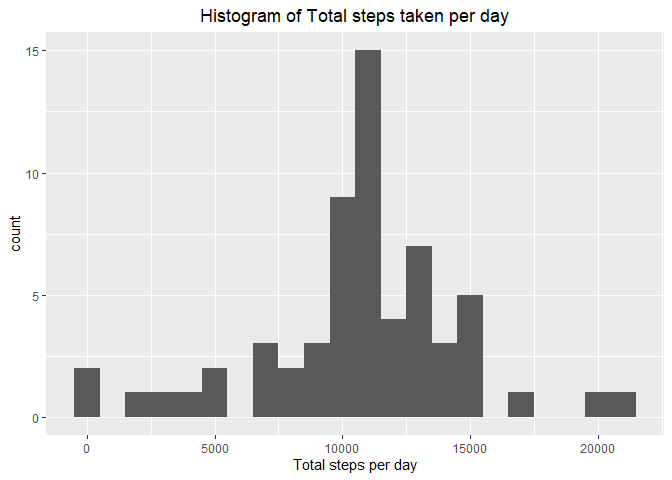
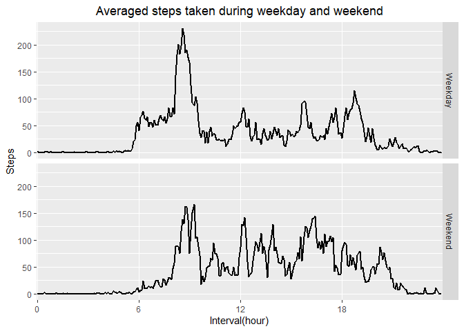

## Loading and preprocessing the data
Loading the data and transform the date variable format; load package

```r
acti <- read.csv( unz("activity.zip", filename = "activity.csv") , header = TRUE, sep = ",")
acti$date <- as.Date(acti$date)

library(ggplot2)
```

```
## Warning: package 'ggplot2' was built under R version 4.0.2
```

```r
library(dplyr)
```

```
## 
## Attaching package: 'dplyr'
```

```
## The following objects are masked from 'package:stats':
## 
##     filter, lag
```

```
## The following objects are masked from 'package:base':
## 
##     intersect, setdiff, setequal, union
```
## What is mean total number of steps taken per day?
Calculate the total steps take per day and its mean and median. Also the histogram of daily steps are plotted.

```r
stepDay <- tapply(acti$steps, acti$date, sum, na.rm = TRUE)
stepDayDF <- data.frame(stepTtlDay = stepDay, Day = unique(acti$date))

theme_update(plot.title = element_text(hjust = 0.5))
g <- ggplot(stepDayDF, aes(stepTtlDay))
g + geom_histogram(binwidth = 1000) + labs(x = "Total steps per day", 
                                           title = "Histogram of Total steps taken per day")
```

<!-- -->

```r
stepDayAve <- mean(stepDay, na.rm = T)
stepDayMed <- median(stepDay, na.rm = T)
```
The average daily steps is 9354.2295082 and the median of daily steps is 10395.

## What is the average daily activity pattern?

```r
interval <- strptime(sprintf("%04d", acti$interval),format = "%H%M")
intervalNum <- interval$hour*60 + interval$min
patDaily <- tapply(acti$steps, acti$interval,mean,na.rm = TRUE)
patDailyDF <- data.frame(patternDaily = patDaily, interv = unique(intervalNum))

g <- ggplot(patDailyDF, aes(x = factor(interv), y = patternDaily, group = 1))
g + geom_line(size = 1) + labs(x = "Interval(hour)", y = "Steps", title = "Daily pattern of activity") +
  scale_x_discrete( breaks = as.character(seq(min(intervalNum),max(intervalNum+5),60*6)),
                    labels = as.character(seq(min(intervalNum)/60,max(intervalNum+5)/60,6)) )
```

<!-- -->

```r
maxStep <- max(patDaily)
maxStepInterval <- format(interval[which.max(patDaily)], format = "%H:%M")
```
The daily maximum steps took within one interval is 206.1698113 and the interval is 08:35

## Imputing missing values

```r
countNA <- sum(is.na(acti$steps))
# filling the NA value with the mean of that interval
filledData <-data.frame(steps = acti$steps, intv = intervalNum)

stepsF <- t(apply(filledData, MARGIN = 1, function(x, refData = patDailyDF)
                   {
                       if(is.na(x[1]))
                       {
                           x[1] <- refData$patternDaily [which(refData$interv %in% x[2])]
                       }
                       return(t(x))
                   }
))
stepsF <- as.data.frame(cbind(stepsF,acti["date"]))
colnames(stepsF) <- c("steps","interval","day")
stepDayF <- tapply(stepsF$steps, stepsF$day, sum, na.rm = TRUE)
stepDayFDF <- data.frame(stepDayF = stepDayF, Day = unique(acti$date))
# plotting
g <- ggplot(stepDayFDF, aes(stepDayF))
g + geom_histogram(binwidth = 1000) + labs(x = "Total steps per day", 
                                           title = "Histogram of Total steps taken per day")
```

<!-- -->

```r
stepDayFAve <- mean(stepDayF, na.rm = T)
stepDayFMed <- median(stepDayF, na.rm = T)
```
After the NAs data are filled, the average daily steps is 1.0766189\times 10^{4} and the median of daily steps is 1.0766189\times 10^{4}. The value is different from result calculated by unfilled data. 

## Are there differences in activity patterns between weekdays and weekends?


```r
# tell if it is weekday by string "S"
stepsF$weekday <- grepl("S.+",weekdays(stepsF$day))
stepsFillWeek <- stepsF %>%
    group_by(weekday,interval) %>%
    summarise(ave = mean(steps))
```

```
## `summarise()` regrouping output by 'weekday' (override with `.groups` argument)
```

```r
stepsFillWeek$weekday <- as.factor(stepsFillWeek$weekday )
# plot
levels(stepsFillWeek$weekday) <- c("Weekday","Weekend")
t <- ggplot(stepsFillWeek, aes(x = factor(interval), y = ave, group = 1))
t + facet_grid(rows = vars(weekday)) +
    geom_line(size = 1) + labs(x = "Interval(hour)", y = "Steps", title = "Averaged steps taken during weekday and weekend") +
    scale_x_discrete( breaks = as.character(seq(min(intervalNum),max(intervalNum+5),60*6)),
                    labels = as.character(seq(min(intervalNum)/60,max(intervalNum+5)/60,6)) )
```

<!-- -->
